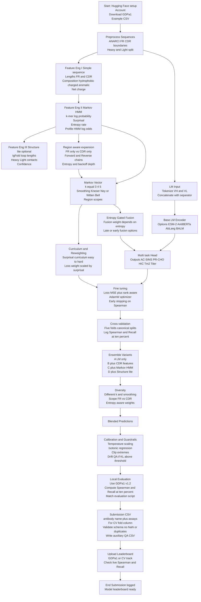

```mermaid
flowchart TD
    %% === START ===
    A[Start: Hugging Face setup<br/>Account<br/>Download GDPa1<br/>Example CSV] --> B[Preprocess Sequences<br/>ANARCI FR CDR boundaries<br/>Heavy and Light split]

    %% === FEATURE EXTRACTION ===
    B --> C1[Feature Eng I Simple sequence<br/>Lengths FR and CDR<br/>Composition hydrophobic charged aromatic<br/>Net charge]
    C1 --> C2[Feature Eng II Markov HMM<br/>k-mer log probability<br/>Surprisal<br/>Entropy rate<br/>Profile HMM log odds]
    C2 --> C3[Feature Eng III Structure lite optional<br/>IgFold loop lengths<br/>Heavy Light contacts<br/>Confidence]
    C2 --> C4[Region aware expansion<br/>FR only vs CDR only<br/>Forward and Reverse chains<br/>Entropy and backoff depth]

    %% === LM PATH ===
    B --> D1[LM Input<br/>Tokenize VH and VL<br/>Concatenate with separator]
    D1 --> D2[Base LM Encoder<br/>Options ESM-2 AntiBERTa AbLang BALM]

    %% === MARKOV PATH ===
    C2 --> E1[Markov Vector<br/>k equal 3 4 5<br/>Smoothing Kneser Ney or Witten Bell<br/>Region scopes]
    C4 --> E1

    %% === FUSION ===
    D2 --> F[Multi task Head<br/>Outputs AC-SINS PR-CHO HIC Tm2 Titer]
    E1 --> G[Entropy Gated Fusion<br/>Fusion weight depends on entropy<br/>Late or early fusion options]
    G --> F

    %% === TRAINING ===
    F --> H1[Fine tuning<br/>Loss MSE plus rank aware<br/>AdamW optimizer<br/>Early stopping on Spearman]
    E1 --> H2[Curriculum and Reweighting<br/>Surprisal curriculum easy to hard<br/>Loss weight scaled by surprisal]
    H2 --> H1
    H1 --> I[Cross validation<br/>Five folds canonical splits<br/>Log Spearman and Recall at ten percent]

    %% === ENSEMBLE ===
    I --> J1[Ensemble Variants<br/>A LM only<br/>B plus CDR features<br/>C plus Markov HMM<br/>D plus Structure lite]
    J1 --> J2[Diversity<br/>Different k and smoothing<br/>Scope FR vs CDR<br/>Entropy aware weights]
    J2 --> K[Blended Predictions]

    %% === POST ===
    K --> L[Calibration and Guardrails<br/>Temperature scaling<br/>Isotonic regression<br/>Clip extremes<br/>Drift QA if KL above threshold]
    L --> M[Local Evaluation<br/>Use GDPa1 v1.2<br/>Compute Spearman and Recall at ten percent<br/>Match evaluation script]

    %% === OUTPUT ===
    M --> N[Submission CSV<br/>antibody name plus assays<br/>For CV fold column<br/>Validate schema no NaN or duplicates<br/>Write auxiliary QA CSV]
    N --> O[Upload Leaderboard<br/>GDPa1 or CV track<br/>Check live Spearman and Recall]
    O --> P[End Submission logged<br/>Model leaderboard ready]

```